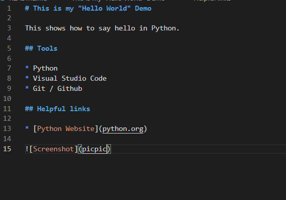

# This is my "Hello World" Demo

This shows how to say hello in Python.

## Tools

* Python 
* Visual Studio Code
* Git / Github

## Helpful links

* [Python Website](python.org)

[My Software Demo Video](https://www.youtube.com/watch?v=HlYH3f-BqII&ab_channel=AmmonWilson)

# Development Environment

I used VS Code and Python 3 for this assignment, and also using Git and Github to post my assignment to that website.

I used the language of Python for this assignment. I was able to print, "Hello World" in VS Code when using that language.

# Useful Websites
* [W3 Schools](w3schools.com/python/python_intro.asp)
* [Web Site Name](http://url.link.goes.here)